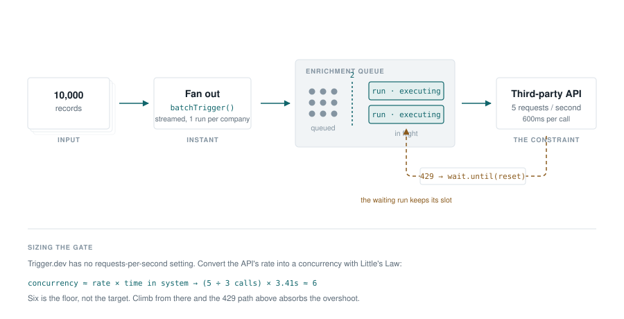
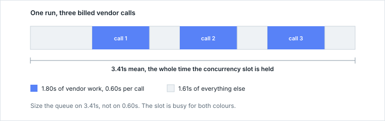
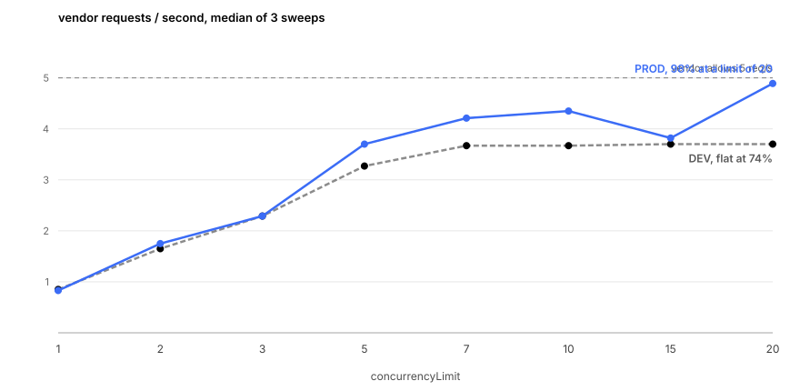
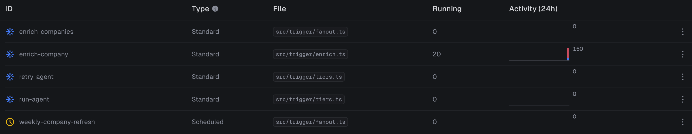

**A vendor sells company data at seventeen cents a lookup and allows five requests a second. You have 10,000 companies. Send them all at once and you're blocked after the fifth call. Loop with a sleep and it runs for hours, and a redeploy in the middle loses track of what you already paid for.**

The vendor is mine, a mock in the repo that holds five tokens, refills at five a second, bills per call and returns real rate-limit headers. Borrowing a real vendor's key to run 1,440 billed calls is not a thing you do twice, and a mock lets me read its counters directly instead of inferring throughput from my own side. Everything else here is real.

Looking up one company takes three calls to it, one for the record, one to verify it, one to score it. So 10,000 companies is 30,000 calls against a vendor that accepts five a second. An hour and forty minutes of continuous calling, minimum, and that assumes nothing goes wrong. Something always goes wrong.

The usual answer is a queue with a concurrency limit. That works, but `concurrencyLimit` doesn't limit your rate. It limits how many runs execute at once, and converting one into the other is most of the work. I got the conversion wrong twice and shipped a limit two and a half times too big. Then I measured it properly. The corrected formula was fine. **What moved was the numbers I was feeding it.** Executing time stretched 3.4x under production load for work that never changed, and my `DEV` environment disagreed with production about nearly everything else.



## `concurrencyLimit` is not a rate limit

```ts trigger/queues.ts
export const enrichmentQueue = queue({
  name: "enrichment",
  concurrencyLimit: 2,
});
```

At most two of that task's runs execute at once. So what rate is that? You can't tell from the number. Two calls at once against a 50ms API is 40 requests a second, and against a two-second API it's one. Same limit, forty times apart.

Trigger.dev has no requests-per-second setting. The request sits on their board [marked Planned, with well over a hundred votes](https://feedback.trigger.dev/p/rate-limiting-on-v3), and the docs answer today is [a community page](https://trigger.dev/docs/guides/community/rate-limiter) pointing at a third-party Redis package. Concurrency is what a queue controls. Rate is what you work out from it, with Little's Law:

```text
concurrency ≈ arrival rate × time in system
```

Both terms have to be in the same currency. That is where this came unstuck, twice.

## The math I got wrong

The first version made one call per run. Vendor allows 5 req/s, each call takes 200ms, so `5 × 0.2 = 1`, pick 2, let retries cover the overshoot. Wrong, and it took a measurement to see why. **That 0.2 is the vendor's response time. The formula wants how long the run holds its slot**, which was 2.2 seconds.

Then the pipeline grew to three billed calls a company:

| Where the time goes | Duration |
| --- | ---: |
| Three vendor calls at 600ms | 1.80s |
| Time the run held its slot | **3.41s** in DEV, 3.60s in PROD |
| Everything else | 1.61s in DEV, 1.80s in PROD |

PROD reaches the mock through a tunnel, so its column carries a network round trip DEV's doesn't. Both figures are means of eight uncontended runs, and PROD's includes one cold start.



So I wrote `5 × 3.4 ≈ 17`, called it 15 because that felt safer, and shipped it. That was the second mistake and the worse one, and it survived a code review, my own included.

Look at those two numbers. The 5 is **calls** per second. The 3.4 is seconds per **run**. Multiply them and the seconds cancel, leaving 17 calls per run. The pipeline makes three. It's a real number answering a question nobody asked, and it isn't runs, which is the only currency the queue counts. One division. Five calls a second at three calls per run is `5 ÷ 3 = 1.67` runs a second.

```text
1.67 runs/s × 3.41 s/run ≈ 6 concurrent runs
```

Six, not seventeen. Nearly three times out, and invisible, because both numbers look like a plausible queue setting.

If the formula feels like a trick, count it the long way. One lookup at a time sends `3 ÷ 3.4 = 0.88` calls a second. You are allowed five. `5 ÷ 0.88 ≈ 5.7`, so six at once. Same answer, no formula.

**Measure the run, not the call, and measure it where you'll run.** Self-hosted has no checkpointing, so there every wait holds its slot, not just the short ones.

## Retries, and the slot they hold

Sizing gets you close, never exact. You also need something that reacts.

```ts
const response = await retry.fetch(url, {
  method: "POST",
  body: JSON.stringify({ domain }),
  retry: {
    byStatus: {
      "429": {
        strategy: "headers",
        limitHeader: "x-ratelimit-limit",
        remainingHeader: "x-ratelimit-remaining",
        resetHeader: "x-ratelimit-reset",
        resetFormat: "unix_timestamp_in_ms",
      },
    },
  },
});

if (!response.ok) throw new Error(`vendor ${response.status} after retries`);
```

I went looking in the SDK source after the third unexplained 429, and found four things. Two of them the docs get wrong. One they never mention at all.

- **Only `resetHeader` is read.** The other two are required by the schema and never consulted when computing the delay.
- **`resetFormat` is a trap.** `unix_timestamp` does `new Date(value * 1000)`. Point it at a countdown header like `Retry-After: 5` and you get a date in 1970, which is in the past, so the retry fires immediately at a vendor that just asked you to wait.
- **It returns the failed `Response` instead of throwing** once it runs out of attempts, so skipping that `response.ok` check records a run that never worked as a success. The docs say the opposite, that an error will be thrown, while their own examples on the same page call `.json()` on the result with no `.ok` check, three times.
- **It caps at 10 attempts.** A hard `MAX_ATTEMPTS` you cannot raise, documented nowhere.

And the part that matters, which is documented. A run doesn't checkpoint until 60 seconds into a wait, and `retry.fetch` waits via `wait.until()`. Any backoff under a minute holds its concurrency slot for the whole wait, so the retry layer spends the budget the queue limit was protecting, and you're billed for the waiting.

## The number you feed the formula doesn't hold still

Eight limits, three sweeps each, 20 companies a sweep, SDK 4.5.10, medians below with the full range. Run once in `DEV`, which routes work through my own machine, then again in a free-plan `PROD` environment reaching the mock through a tunnel, whose round trip PROD's numbers carry.

One caveat that matters for reading the table. The script times each sweep with a two-second poll, so every elapsed figure lands on a two-second grid. That's coarse, and it is the same instrument that killed draft one.



| `concurrencyLimit` | DEV req/s | PROD req/s | PROD range |
| ---: | ---: | ---: | :--- |
| 1 | 0.85 | 0.83 | 0.83 to 0.88 |
| 2 | 1.65 | 1.75 | 1.75 to 1.86 |
| 3 | 2.29 | 2.29 | 2.12 to 2.29 |
| 5 | 3.27 | 3.70 | 2.97 to 3.70 |
| 7 | 3.67 | 4.21 | 4.20 to 4.22 |
| 10 | 3.67 | 4.35 | 4.34 to 4.43 |
| 15 | 3.70 | 3.82 | 3.70 to 4.29 |
| **20** | 3.70 | **4.89** | 4.27 to 5.08 |

In `DEV`, throughput climbs to 7 and stops dead. Seven, ten, fifteen, twenty, all the same number, never past 3.70 req/s, 74% of what the vendor allows. A flat line like that has one obvious reading and I took it without much argument. The vendor is refusing the extra calls. I shipped a draft on that, unable to say why the ceiling sat at 74% rather than 100%.

`PROD` says why. Same code, same vendor, same sweep, and at a limit of 20 it reaches 4.89 req/s. If the vendor were the thing holding me at 3.70, production could not have gone faster against it. It did. **The plateau was my laptop, not the vendor**, and I had spent a draft explaining a limit that was mine.

That 4.89 is 98% of what the vendor allows, against DEV's 74%. But the curve isn't tidy and I won't pretend it is. My own script prints "the peak is not clean", and at that resolution most of its shape is noise. Five sweeps counted 21 companies instead of 20, when a straggler from the previous sweep crossed the counting window. Three of them are the whole limit-10 row: recount it on 60 calls and it reads 4.21, identical to limit 7, whose sweeps took the same 14.2 seconds. The fourth is the limit-15 median, so that 3.82 should read 3.70. The fifth is one of the three reps behind 4.89, and reads 5.08, above the vendor's nominal five.

So take the ends, not the shape. At a limit of 7, three PROD sweeps took 14.2, 14.2 and 14.3 seconds. Three DEV sweeps at the same limit took 16.3, 16.3 and 16.4. Quantized, that puts PROD's true elapsed somewhere in (12.2, 14.3] and DEV's in (14.3, 16.4], and the two windows don't overlap. Six sweeps, no overlap, same code, same vendor. 84% against 74%, and the wobble in between isn't worth arguing about.

So the formula earns its keep as a floor. At 7 you get 84% of the vendor's rate, and the last 14% costs three times the slots.

## Asking for 20, getting 13

`concurrencyLimit` is a number you request. `queues.retrieve` reads it back whether or not a single run is using it, so I counted instead. Every run records when it started and finished. Lay the intervals on a timeline, count the most that ever overlapped.

| asked for | DEV reached | PROD reached |
| ---: | ---: | ---: |
| 10 | 9 | 10 |
| 20 | **13** | **20** |

**A limit the platform accepts is not a limit it reaches.** DEV gave me 13 of 20, which makes the 15 and 20 rows of that sweep two more readings of about 13.

The docs disagree with themselves about why. The queues page says only executing runs count. The troubleshooting page says `DEQUEUED` runs count too. Their [incident report of 22 June 2026](https://trigger.dev/blog/incident-report-jun-22-2026) is blunter. "The worst one: queued runs held onto concurrency. When a run moves from the main queue into a per-worker queue but hasn't started yet, it still counts against your concurrency limit." My seven missing slots weren't missing. They were spoken for.

`PROD` missed the other way and gave me all 20, on a free account documented at 10, where the queues page says "any single queue can have at most 10 concurrent runs".



That is their dashboard, not mine, counting twenty. Twenty is that base times the documented 2.0x burst, so a single queue apparently can spend the whole environment's burst, and that sentence goes unenforced. Both ceilings lie. Count what executes.

Those timestamps carry a number I wasn't looking for. Uncontended in PROD, a run spends 3.34 seconds executing. At a limit of 10, 5.80s. At 20, **11.22s. Identical work, 3.4 times slower, with nineteen other runs queueing for the same five tokens a second.**

## What I'd take away

- **Units first.** Runs per second times seconds per run. I multiplied a request rate by a run duration, got 17, shipped 15, and the answer was 6.
- **Measure at concurrency 1, then climb and watch.** Under load the same work ran 3.4 times slower, so a number taken under contention describes your queue, not your task. Stop climbing when run times rise and throughput doesn't follow.
- **Count what executes.** DEV gave 13 of a requested 20. A free-plan PROD queue gave 20 where the docs promise 10.
- **Retries spend the budget the limit was protecting.** Any backoff under a minute holds its slot throughout.
- **Spell out `scope: "global"` on idempotency keys.** Since 4.3.1 a raw string key defaults to `run` scope, which mixes in the parent run id, so the weekly refresh mints fresh keys and pays for all 10,000 companies again.

Draft one of this article claimed throughput *fell* past a limit of 10, built on a 1.99-second reading from a loop polling every two seconds. Three sweeps killed it. Draft two said it saturated at 7 and stayed there. Production killed that. The only sentence that survived all three drafts is the one about checking your units.

The [pipeline and every script](https://github.com/mostafaibrahim17/triggerdev-concurrency-is-not-a-rate-limit) are on GitHub, with the mock vendor and the raw output of both sweeps, including the rows I would rather have left out. If your lookup job has outgrown a `for` loop with a `sleep` in it, it's worth an afternoon. Just run the sweep somewhere real before you trust the number it gives you.
