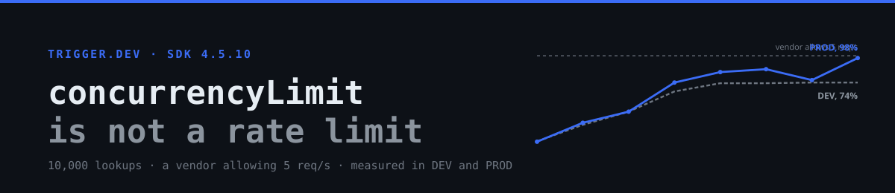
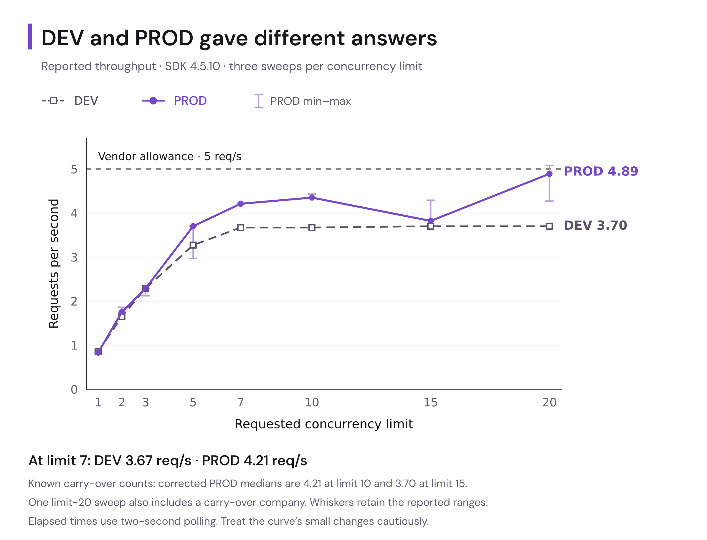
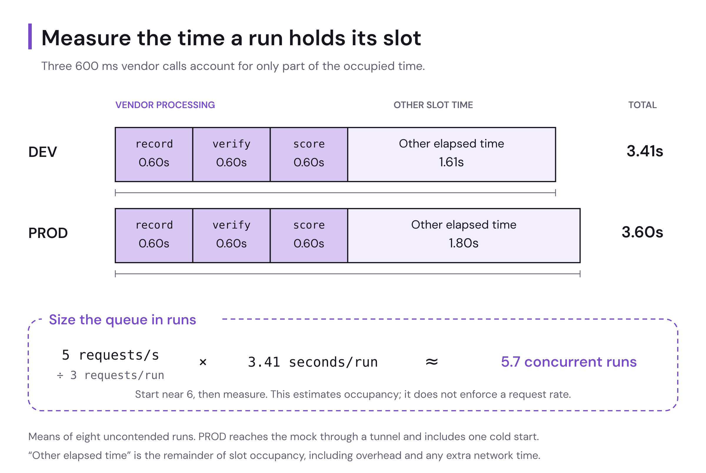
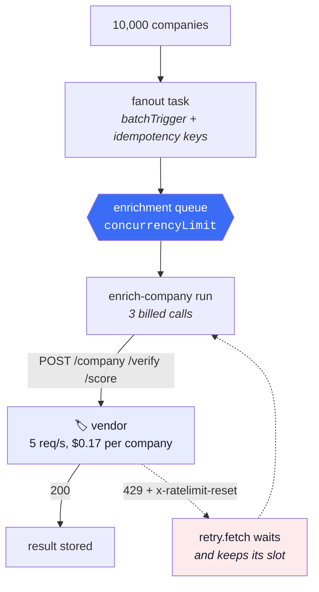
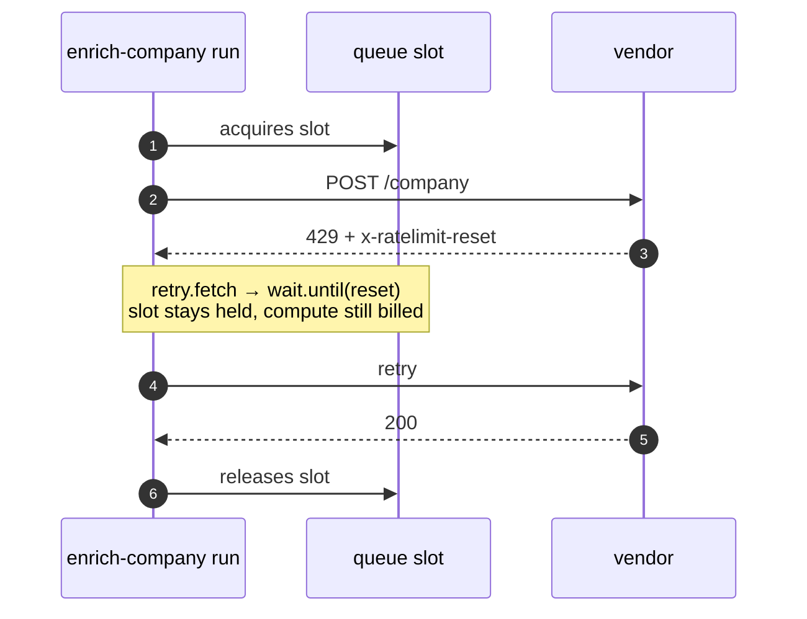

<p align="center">
  
</p>

# `concurrencyLimit` is not a rate limit

Fan 10,000 company lookups out to a vendor that allows **five requests a second** and bills **$0.17 a lookup**, without going over the limit and without losing track of what you already paid for when something restarts. It runs on [Trigger.dev](https://trigger.dev) v4: a durable run per company, a concurrency-limited [queue](https://trigger.dev/docs/queue-concurrency), [`retry.fetch`](https://trigger.dev/docs/errors-retrying) for the 429s that get through, and [idempotency keys](https://trigger.dev/docs/idempotency) so the weekly refresh never re-buys data it already has. The interesting part isn't the pipeline. It's that sizing its queue took two wrong answers and two environments to get right.

[](https://nodejs.org/)
[](https://trigger.dev/docs)
[](https://www.typescriptlang.org/)
[](https://trigger.dev/pricing)
[](./data)

> **TL;DR.** Little's Law sizes the queue, but only if you convert the vendor's **request** rate into a **run** rate first; skipping that gave 17 where the answer was 6. Then the same sweep disagreed across environments: `DEV` plateaued at **74%** of the vendor's allowance and never exceeded it, while `PROD` reached **98%**. A requested limit of 20 ran **13** in DEV and **20** in PROD, the latter above the documented single-queue cap for a free plan. And the time term isn't a constant: identical work took **3.4x longer** under load. Every figure below traces to raw console output kept in [`data/`](./data).

<p align="center">
  
  <br/>
  <em>The same sweep in two environments. The dashed line is DEV, flat from a limit of 7; the solid line is PROD, still climbing at 20.</em>
</p>

<p align="center">
  
  <br/>
  <em>Where a single run's three and a half seconds go. The slot is held for the whole bar, not just the blue.</em>
</p>

---

## Contents

- [How it works](#how-it-works)
- [The arithmetic, twice wrong](#the-arithmetic-twice-wrong)
- [Then the environments disagreed](#then-the-environments-disagreed)
- [The limit you set is not the one you get](#the-limit-you-set-is-not-the-one-you-get)
- [What a retry actually costs](#what-a-retry-actually-costs)
- [Run it](#run-it)
- [Reproduce the measurements](#reproduce-the-measurements)
- [Project layout](#project-layout)
- [Things worth knowing before you copy this](#things-worth-knowing-before-you-copy-this)
- [The write-up](#the-write-up)

---

## How it works

Each company becomes its own durable run. The queue admits a few at a time, each run makes three billed calls, and a rejected call comes back as a 429 with a reset timestamp that the run waits out before trying again.



The vendor is a mock bundled here: a token bucket, three priced endpoints, real rate-limit headers, and a `?chaos=1` flag that refuses everything on demand. So the whole pipeline runs on the free plan at no real cost, and the money still adds up.

---

## The arithmetic, twice wrong

Trigger.dev has **no requests-per-second primitive**. `concurrencyLimit` caps *simultaneous runs*, not the rate at which they start. Converting one into the other is Little's Law, and both terms have to be in the same currency:

```
concurrency ≈ arrival rate × time in system
```

**The time term isn't the API's response time.** It's how long the run holds the slot:

| Measured over 8 uncontended runs | |
| --- | ---: |
| Three vendor calls at 600ms | 1.80s |
| Run, created to finished | **3.41s** DEV, 3.60s PROD |
| Everything else | 1.61s DEV, 1.80s PROD |

**The rate term is in runs, not requests.** The queue counts runs, so divide by calls-per-run before multiplying:

```
(5 req/s ÷ 3 calls per run) × 3.41s ≈ 6 concurrent runs
```

Multiply 5 by 3.41 instead and you get 17, which is a count of requests, not a concurrency. That mistake is why this README used to say 15.

---

## Then the environments disagreed

Eight concurrency limits, three sweeps of 20 companies each, run in `DEV` and again in `PROD`. Medians, from the vendor's own counters:

| `concurrencyLimit` | DEV req/s | PROD req/s | PROD range |
| ---: | ---: | ---: | :--- |
| 1 | 0.85 | 0.83 | 0.83 to 0.88 |
| 2 | 1.65 | 1.75 | 1.75 to 1.86 |
| 3 | 2.29 | 2.29 | 2.12 to 2.29 |
| 5 | 3.27 | 3.70 | 2.97 to 3.70 |
| 7 | 3.67 | 4.21 | 4.20 to 4.22 |
| 10 | 3.67 | 4.35 | 4.34 to 4.43 |
| 15 | 3.70 | 3.82 | 3.70 to 4.29 |
| 20 | 3.70 | **4.89** | 4.27 to 5.08 |

In `DEV`, raising the limit past 7 changes nothing and throughput never exceeds **74%** of the vendor's allowance. A whole draft of the write-up was built on that plateau without knowing its cause. In `PROD` the same sweep reaches **98%**, so the ceiling was the dev worker, not the vendor.

Six is a floor worth starting from, not an answer. Measure in the environment you will actually run in.

---

## The limit you set is not the one you get

`concurrencyLimit` is a number you request. Counting from each run's own `startedAt` and `finishedAt`:

| Requested | DEV reached | PROD reached |
| ---: | ---: | ---: |
| 10 | 9 | 10 |
| 20 | **13** | **20** |

DEV reached 13 while `queues.retrieve` reported `concurrencyLimit: 20` throughout. PROD reached 20 on a **free plan documented at 10**, which is exactly base × the documented 2.0x burst factor. The ceiling misses in both directions, so count what executes.

---

## What a retry actually costs

A 429 backoff under 60 seconds holds its concurrency slot for the whole wait, because runs don't checkpoint until a minute in. The retry layer spends the budget the cap was protecting.



Under PROD load that shows up as time: executing time rose from about 3.4s uncontended to **5.80s** at a limit of 10 and **11.22s** at 20. Identical work, 3.4 times slower, because other runs are competing for the same five tokens a second.

---

## Run it

**Prerequisites**

- Node.js ≥ 20
- A free Trigger.dev project: [cloud.trigger.dev](https://cloud.trigger.dev)

**Install and configure**

```bash
git clone https://github.com/mostafaibrahim17/triggerdev-concurrency-is-not-a-rate-limit.git
cd triggerdev-concurrency-is-not-a-rate-limit
npm install
cp .env.example .env
```

Log in and set your project ref. `TRIGGER_SECRET_KEY` comes from the dashboard under API Keys; the scripts need it, the CLI does not.

```bash
npx trigger.dev login
export TRIGGER_PROJECT_REF=proj_xxxxxxxx
```

Pull the company list. Real domains from the Majestic Million, free, no key:

```bash
npm run seed                    # 500 companies (default)
npm run seed -- --limit 10000   # the full fan-out
```

**Three terminals**

```bash
npm run mock-api    # the rate-limited vendor
npm run dev         # the Trigger.dev dev server
npm run trigger -- --watch
```

Then try both paths:

- **Retries:** `npm run trigger -- --offset 200 --limit 3 --chaos` forces a 429 on every call and lets you watch `retry.fetch` absorb them.
- **Idempotency:** run `curl localhost:7788/stats`, then `npm run trigger -- --limit 12`, then check `/stats` again. The spend doesn't move.

`--offset` matters: idempotency keys last 30 days, so re-running companies you already looked up does nothing at all.

---

## Reproduce the measurements

```bash
npm run experiment   # the sweep: 8 limits x 3 repeats, both tables above
npm run peak         # how many runs actually executed at once
npm run runwall      # uncontended run timings
```

Point the same scripts at production by swapping in a `tr_prod_` key. Every number in the write-up came from these three commands, and their raw output is in the repo:

| File | What it holds |
| --- | --- |
| [`data/sweep-2026-09-14.txt`](./data/sweep-2026-09-14.txt) | DEV sweep, 24 runs, medians and ranges |
| [`data/sweep-prod-2026-09-19.txt`](./data/sweep-prod-2026-09-19.txt) | PROD sweep, same shape, plus uncontended timings |
| [`data/peak-prod-2026-09-19.txt`](./data/peak-prod-2026-09-19.txt) | Concurrency actually reached |

A sweep over company ids an earlier sweep already touched measures nothing: the idempotency keys dedupe the triggers silently. Use fresh ids.

---

## Project layout

| Path | What it does |
| --- | --- |
| `src/trigger/queues.ts` | The concurrency cap, and the Little's Law arithmetic behind the number. |
| `src/trigger/enrich.ts` | The per-company durable task: three billed vendor calls. |
| `src/trigger/fanout.ts` | Streamed `batchTrigger`, idempotency keys, and the weekly refresh. |
| `src/lib/provider.ts` | `retry.fetch` with the 429 headers strategy. |
| `scripts/mock-api.ts` | Token-bucket vendor: three priced endpoints, real rate-limit headers, `?chaos=1`. |
| `scripts/experiment.ts` | The throughput sweep: 8 limits, 3 repeats, medians with ranges. |
| `scripts/peak.ts` | Peak concurrency, counted from run timestamps. |
| `scripts/runwall.ts` | Uncontended run timings. |
| `scripts/seed.ts` | Builds the company list from the Majestic Million. |
| `scripts/run.ts` | Triggers the pipeline from outside, the way your backend would. |
| [`ARTICLE.md`](./ARTICLE.md) | The write-up: the measurements and what they changed. |
| [`TUTORIAL.md`](./TUTORIAL.md) | Build the same pipeline from an empty directory, step by step. |

---

## Things worth knowing before you copy this

All verified against SDK 4.5.10. Several are undocumented, and two contradict the docs.

**Retries**

- **`retry.fetch` returns the failed `Response` instead of throwing.** Check `response.ok` yourself or failures pass as successes. The docs say it throws, and their own examples call `.json()` without checking.
- **Only `resetHeader` is read** by the `headers` strategy. `limitHeader` and `remainingHeader` are required by the schema and then ignored.
- **`resetFormat: "unix_timestamp"` means seconds since epoch.** Point it at a countdown like `Retry-After: 5` and it resolves to 1970, so the retry fires immediately and hammers the API.
- **It hard-caps at 10 attempts** regardless of what you configure.
- **A backoff under 60 seconds holds its slot**, because runs don't checkpoint until a minute into a wait.

**Concurrency**

- **`concurrencyKey` multiplies your load, it doesn't divide it.** Each distinct key gets its own copy of the queue *at the full limit*. Only use it when the vendor quota is genuinely per-tenant.
- **Count what executes.** `queues.retrieve` reported 20 in DEV while 13 was the most that ever ran.
- **`maxDuration` is required** in `TriggerConfig` as of 4.5.10, though the docs list it as optional.
- **Retries are disabled in dev** by the CLI's `init`. This repo turns them back on, or you would never see any retry behaviour locally.

**Idempotency**

- **Keys dedupe triggers, not attempts.** If a paid call succeeds and the run throws afterwards, the retry calls again. Use the vendor's own idempotency key for that.
- **Raw-string keys default to `run` scope** since 4.3.1, not `global`. Pass `{ scope: "global" }` explicitly or re-runs won't dedupe. That breaking change is in the docs and in neither changelog.
- Failed runs release their key automatically.

**Batching**

- **Streamed `batchTrigger` only works on the task instance method.** `myTask.batchTrigger(asyncIterable)` works; `tasks.batchTrigger(id, items)` takes arrays only. It buffers internally, so it's ergonomics, not a higher ceiling.
- **The free plan processes one batch at a time** (Hobby and Pro get 10). Intake is capped too: 1,200 runs of burst, refilling 100 every 10 seconds.
- **Metadata caps at 256KB.** Counters are fine. A row per company is not.

---

## What one company costs

Three billed calls each: `/company` $0.10, `/verify` $0.02, `/score` $0.05. That's **$0.17 per company**, so 10,000 is $1,700 of vendor spend. `curl localhost:7788/stats` reports calls, rejections and the running total.

Look up the same companies twice and the total doesn't move. That's the 30-day freshness window doing its job.

---

## The write-up

[**`ARTICLE.md`**](./ARTICLE.md) is the companion piece: the two wrong answers, the sweep that killed one draft's thesis, the environment comparison that killed the next one's, and what the numbers say you should actually do.

If you would rather build it than read about it, [`TUTORIAL.md`](./TUTORIAL.md) walks the same pipeline from an empty directory.

### A note on the numbers

The mock vendor is reached through a Cloudflare tunnel in the PROD runs, so those figures include an extra network round trip. Five PROD sweeps counted 21 companies instead of 20 when a straggler crossed the counting window, which inflates the limit-10 row by about 5%; the raw log says so, and `npm run experiment` prints `the peak is not clean` when ranges overlap. The ends of the curve are solid, the middle is worth rerunning.

## License

MIT
